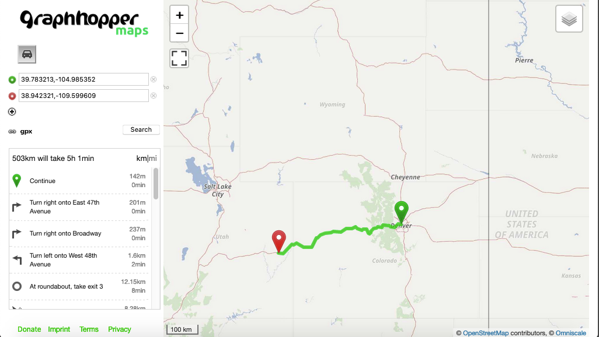

# graphhopper
graphhopper routing service locally
## Quickstart
### Clone this repo
```
cd ~
```

```
git clone ...
```

```
cd graphhopper
```
### Download the data
These files are large (on the order of 10-50 GB).  From the .osm.pbf file, graphhopper will make a directory for the network locally the first time you start the server.  This will also take longer for larger networks, but only the first time you start the server.

As a demonstration, I started with the american west:
```
wget http://download.geofabrik.de/north-america/us-west-latest.osm.pbf
```

North America is here:
```
wget http://download.geofabrik.de/north-america/us-latest.osm.pbf
```

### start the graphopper server:
start a new tmux session:

run code to start server (you'll need to be in the same directory as the graphhopper-web-0.12.0.jar file and the config.yml file)
```
java -Dgraphhopper.datareader.file=us-west-latest.osm.pbf -jar graphhopper-web-0.12.0.jar server config-example.yml
```
The server probably took 10 minutes to start up on my machine, then I tested it from the terminal like this:

```
curl 'http://localhost:8989/route/?point=39.743123,-105.15241&point=39.742867,-105.152142&points_encoded=false'
```
should return:

{"hints":{"visited_nodes.average":"16.0","visited_nodes.sum":"16"},"info":{"copyrights":["GraphHopper","OpenStreetMap contributors"],"took":3},"paths":[{"distance":555.661,"weight":76.176521,"time":76170,"transfers":0,"points_encoded":false,"bbox":[-105.153699,39.741301,-105.151967,39.743188],"points":{"type":"LineString","coordinates":[[-105.152407,39.743136],[-105.152801,39.743188],[-105.153029,39.743108],[-105.153236,39.742984],[-105.153332,39.742777],[-105.15337,39.742472],[-105.153434,39.742245],[-105.153533,39.742039],[-105.153641,39.74188],[-105.153699,39.74183],[-105.15352,39.741699],[-105.153264,39.741301],[-105.153023,39.741412],[-105.152733,39.741577],[-105.152482,39.741356],[-105.152383,39.741425],[-105.152222,39.741596],[-105.152088,39.741794],[-105.151994,39.742056],[-105.151967,39.742293],[-105.152039,39.742757],[-105.152121,39.742876]]},"instructions":[{"distance":214.106,"heading":279.8,"sign":0,"interval":[0,9],"text":"Continue onto Cole Blvd","time":25692,"street_name":"Cole Blvd"},{"distance":70.596,"sign":-2,"interval":[9,11],"text":"Turn left","time":12704,"street_name":""},{"distance":55.034,"sign":-2,"interval":[11,13],"text":"Turn left","time":9906,"street_name":""},{"distance":32.645,"sign":2,"interval":[13,14],"text":"Turn right","time":5875,"street_name":""},{"distance":183.28,"sign":-2,"interval":[14,21],"text":"Turn left onto Cole Blvd","time":21993,"street_name":"Cole Blvd"},{"distance":0.0,"sign":4,"last_heading":332.23530708455917,"interval":[21,21],"text":"Arrive at destination","time":0,"street_name":""}],"legs":[],"details":{},"ascend":0.0,"descend":0.0,"snapped_waypoints":{"type":"LineString","coordinates":[[-105.152407,39.743136],[-105.152121,39.742876]]}}]}

### You can query the server graphically from your web browser:

in your browser, go to:
http://localhost:8989/maps/
you should be able to do this:

### python scripting
requires the requests module.  See ```query_ghop.py```


### To shut down the routing server:
```
ctrl-c
```
